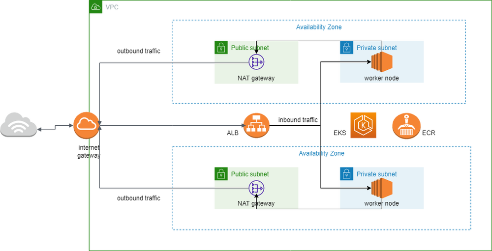

## ECS cluster

This is a terraform project in charge of creating the IaC for an EKS cluster in aws, the application hosted
in the cluster can be found in the following repository:

https://github.com/SalvadorM271/testmernapp/tree/feature/new_feature

## AWS services and resources use:

- VPC
- Subnets
- Security groups
- Internet Gateway
- NAT gateway
- EKS cluster
- Application Load Balancer
- Autoscaling
- Cloudwatch logs

## controllers use in the kubernetes cluster (EKS):

- external dns for DNS configuration
- load balancer controller to configure the application load balancer
- secrets-store-csi-driver to use AWS secrets manager secrets instead of default kubernetes secrets
- argoCD controller to implement GitOps on the infrastructure
- EFS CSI driver so EFS volumens can be use inside the cluster

## How it works 

This is a multi AZ deployment of a mern stack app, I have use two availability zones to deploy the application, each has one public subnet and one private the private subnet is used to deploy the worker nodes giving us an isolated place to host the app which causes the app to be unable to connect to the internet directly, in order to remedy that i have set up NAT gateways in the public subnet in order to route outbound request from our application to the internet gateway which is what i use to connect the VPC to the internet, I have two NATs gateways in order to keep the infrastructure up even if one of the AZ fails (in reality only one is needed but is best to have two for production environments), additionally i have set up a load balancer whit the help of the load balancer controller and my ingress.yml, in order to route traffic to my frontend service, as for the worker nodes i have chosen to use manage worker nodes since they require less maintenance on our parts since AWS takes care of updating the guess operating system of the EC2 instances, lastly i want to point out that this infrastructure has been develop having microservices in mind since having our different services decouple makes for a more resilient application that wont fail even if any of its components stops working, this together with the use of IaC makes for an easier experience when dealing with critical errors.

## Diagram

